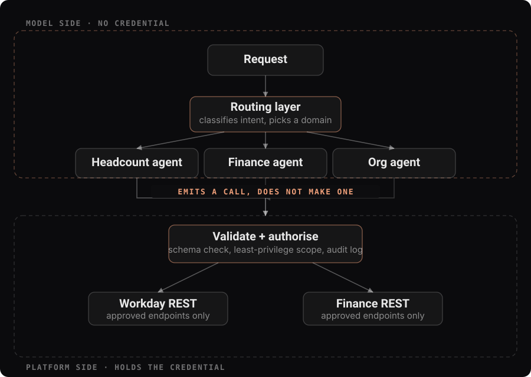
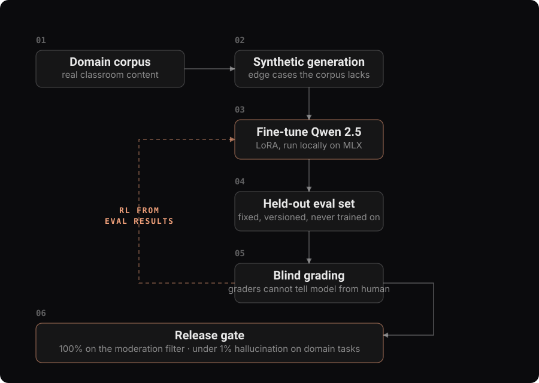
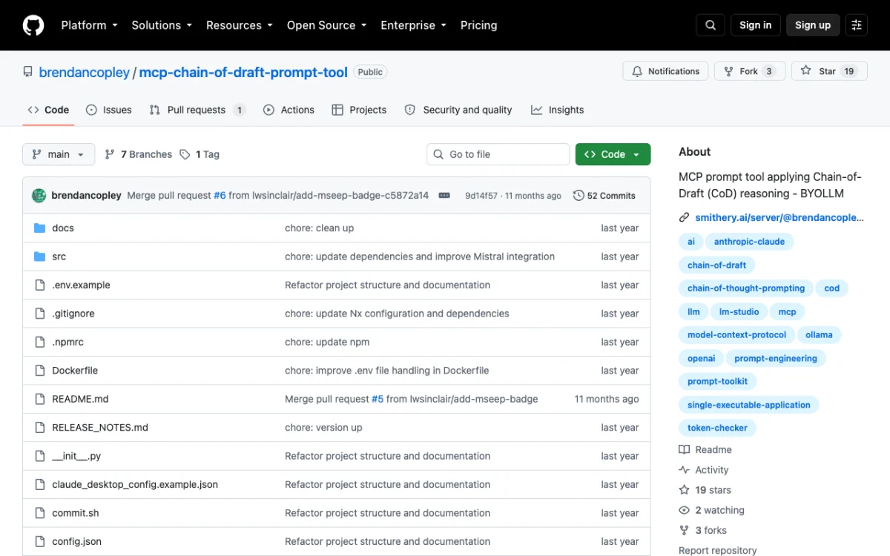
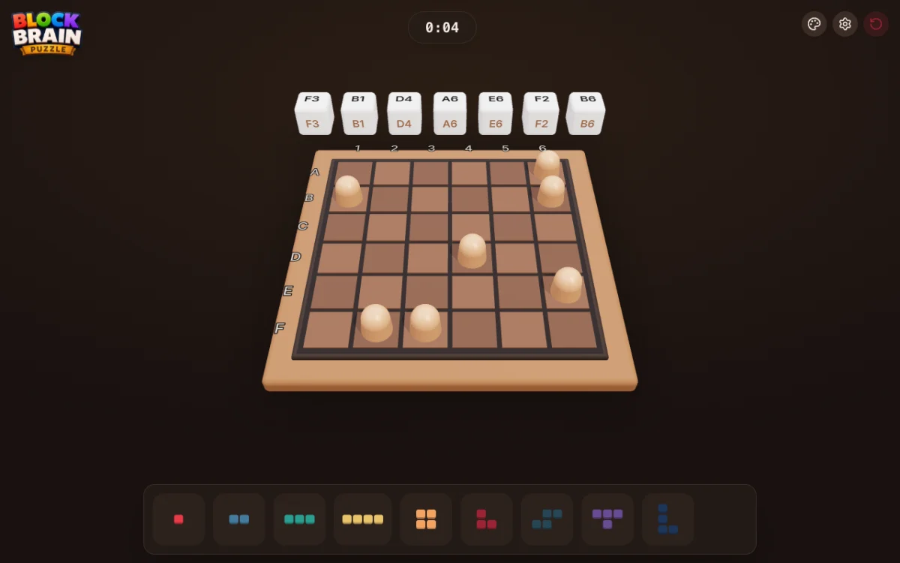

I am a principal engineer with 12+ years shipping production software, now working on agentic
AI systems: multi-agent architecture, tool and permission design, evaluation pipelines, and
fine-tuning when a local model beats an API call.

Senior AI Software Engineer at **Cisco**. Consulting independently through **RADFAB**.

[brendancopley.com](https://brendancopley.com) · [LinkedIn](https://www.linkedin.com/in/brendancopley) · [Book a call](https://cal.com/radfab)

---

## How I build agents that survive production

Most agent architectures put the model in the data path: it holds a token, calls an API,
reasons over the rows. That is the obvious design, and it is the one that fails an enterprise
security review.

Invert it. The model does not call anything. It **emits a structured intent** and the platform
decides whether to execute it.

The model still reasons over the data. It never holds the credential, never builds the
request, and never reaches an endpoint nobody approved. You get an audit trail from your own
code rather than from a model's account of what it thinks it did, and a prompt injection can
at worst ask for something the caller was already allowed to ask for.

This is the shape of the workforce-planning platform I architected at Cisco: roughly 2M
records in under five seconds, a multi-day planning cycle reduced to hours, on OpenShift and
Kubernetes.

---

## How I know it is working

An agent that cannot be measured cannot be improved, only fiddled with. Someone adjusts a
prompt, it looks better on the three examples anyone remembers, and something else silently
regresses.

This is the pipeline behind the content-moderation agent at Renaissance Learning: synthetic
data for the edge cases the corpus lacks, a held-out eval set that is never trained on, blind
grading, and a release gate rather than a judgement call. It reached 100% on the moderation
filter and under 1% hallucination on domain tasks, then went out across every production
agent on a platform serving 44 million students daily.

---

## Selected work

<table>
<tr>
<td width="50%" valign="top">

**Cisco WWAI Multi-Agent Platform**
LangGraph routing layer dispatching to domain-specialised agents, each with least-privilege
access to approved REST endpoints. ~2M records in under 5s.

</td>
<td width="50%" valign="top">

**Content Moderation Agent, Renaissance Learning**
Locally fine-tuned Qwen 2.5 in NestJS, with synthetic data, RL from eval results and blind
grading. 100% on the moderation filter, under 1% hallucination. 44M students daily.

</td>
</tr>
<tr>
<td width="50%" valign="top">

**MCP Chain of Draft**
Chain-of-Draft prompting delivered as a Model Context Protocol server, usable with whichever
model you bring. My most-starred repository, adopted by 30+ engineers.

</td>
<td width="50%" valign="top">

**Block Brain Puzzle**
62,208 valid boards from a seven-dice roll, with a solver validating every generated board is
actually solvable. Final project for CS50 at Harvard; scored 100.

</td>
</tr>
<tr>
<td width="50%" valign="top">

**Fallout at CCXP**
On-prem LibSQL leaderboard game for the Fallout TV launch with Amazon Prime Video and
Bethesda. 5,000+ players across CCXP Brazil and Mexico City.

</td>
<td width="50%" valign="top">

**Ethika**
Orders and shipping refactored onto AWS Lambda and API Gateway, storefront moved to a Vue SPA
on S3 and CloudFront, with CI/CD and Cypress end-to-end tests behind it.

</td>
</tr>
</table>

---

## Work with me

I take AI systems from prototype to production. If you have an agent that works in a demo and
needs to survive real data, real permissions and real volume, that is the work I do.

---

## Currently

- Senior AI Software Engineer at **Cisco**
- Consulting independently through **RADFAB**
- Speaker at the **OC AI Tinkerers Guild**, Chapman University
- Reading for a **BLA in Computer Science, Harvard Extension School**

<b>Full career</b>

 

| | | |
|---|---|---|
| **Cisco** | Senior AI Software Engineer | Jun 2025 - Present |
| **RADFAB** | AI Software Engineer Consultant | Mar 2015 - Present |
| **Renaissance Learning** | Senior Software Engineer | May 2023 - May 2025 |
| **Ethika** | Senior Web Developer, DevOps | Apr 2018 - May 2023 |
| **Utelogy** | Lead Software Developer | Nov 2016 - Apr 2018 |
| **TRAFFIK** | Web Developer | Sep 2016 - Nov 2016 |
| **Young Company** | Programmer & Web Designer | Jun 2016 - Sep 2016 |
| **AKUA Mind & Body** | Programmer, Web Designer & SEO Manager | Jan 2016 - Jun 2016 |
| **Independent** | Freelance Web Developer | Sep 2009 - Jun 2016 |

Full write-ups, with the situation and the result for each, are on
[brendancopley.com](https://brendancopley.com).

<b>Stack</b>

 

**Agents and models** LangGraph · LangChain · LangSmith · Model Context Protocol · MLX · LoRA and QLoRA fine-tuning · evaluation pipelines

**Languages** Python · TypeScript · C# · PHP

**Platform** Kubernetes · OpenShift · AWS · Azure · Docker · Kafka · NestJS · Nuxt and Vue

<b>GitHub stats</b>

 

> These cards are rendered by a third-party service and are sometimes unavailable.

